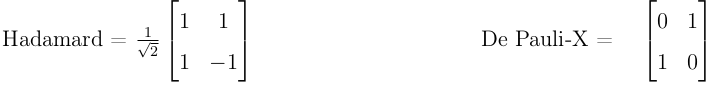

---


# **QISKIT2VIDEO : LIBRARY FOR VISUALIZING THE QUBIT IN QUANTUM CIRCUITS USING THE BLOCH SPHERE** 🌐  

**The `qiskit2video` library enables animated visualizations of a qubit’s quantum state on the Bloch sphere, offering customizable animation speed and frame rate for enhanced control.**  

**A powerful tool for representing the state of a single qubit in a quantum circuit and visualizing its transformations on the Bloch sphere.**  

## 📊 **Qubit Analysis on the Bloch Sphere**  

This project evaluates and visualizes single-qubit states in quantum circuits, demonstrating their transformations on the Bloch sphere.  

## ⚗️ **Theoretical Background**  

The qubit—quantum computing’s fundamental unit—extends classical bits by allowing superposition of basis states ($\ket{0}$ and $\ket{1}$). These states are represented as vectors in Hilbert space with complex coefficients.  

A qubit’s state is expressed as:  

$$\ket{\psi} = \alpha\ket{1} + \beta\ket{0}$$  

Here, $\alpha$ and $\beta$ are complex values satisfying $|\alpha|^2 + |\beta|^2 = 1$, defining the measurement probabilities of $\ket{\psi}$ collapsing to either basis state.  

Quantum gates manipulate qubit states via unitary matrices with complex elements.  

## 🎛️ **Project Workflow**  

1. **State Extraction**: A function ingests a single-qubit circuit and returns its state vector.  
2. **State Tracking**: Each state vector is stored in a sequential list.  
3. **Visualization**: The list is passed to a Manim-based function, generating a video of state transitions on the Bloch sphere.  
4. **Gate Demonstrations**: Includes Hadamard and Pauli-X gates.  

  

## **Usage**  

1. **Clone the Repository**:  
   ```bash  
   git clone https://github.com/lasdi/qiskit2video.git  
   ```  

2. **Run the Code**: Execute the provided scripts to analyze and visualize qubit transformations.  

3. **Contribute**: Fork the repository, implement improvements, and submit pull requests.  

## **Prerequisites**  

- [Python 3](https://www.python.org/downloads/)  
- [Qiskit](https://qiskit.org/documentation/install.html)  
- [Manim](https://docs.manim.community/en/stable/installation.html)  

## **Example**  

```python  
from qiskit2video import *  

qreg_q = QuantumRegister(1, 'q')  
creg_c = ClassicalRegister(0, 'c')  
circuit = QuantumCircuit(qreg_q, creg_c)  

# Apply quantum gates  
circuit.h(qreg_q[0])  
circuit.x(qreg_q[0])  
circuit.y(qreg_q[0])  
circuit.z(qreg_q[0])  

# Render animation (speed=30, frames=60)  
circuit.video(speed=30, frames=60)  
```  

## **Output**  
https://github.com/lasdi/qiskit2video/assets/146500715/8c778b1a-dc34-4542-83a4-20af3c505dde  

---

### **Contributions Welcome!** 🔍  
Found a bug or have a feature idea? Open an issue or submit a pull request.  

**License**: Apache 2.0 (see [LICENSE](LICENSE)).  

**Explore the wonders of quantum computing with dynamic Bloch sphere visualizations!** ⚛️  

---  