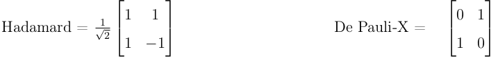

# QISKIT2VIDEO  
### Visualizing Single-Qubit Quantum States on the Bloch Sphere 🎥⚛️

**qiskit2video** is a research-oriented Python project for **visualizing the evolution of a single qubit** in quantum circuits using animated Bloch sphere representations.

The project focuses on **educational and exploratory visualization**, combining **Qiskit** for quantum state simulation and **Manim** for high-quality animations.

> ⚠️ **Current Scope**: This project currently supports **single-qubit circuits only**, with emphasis on clarity, correctness, and visual understanding of quantum state transformations.

---

## 📊 Qubit Analysis on the Bloch Sphere

This project evaluates and visualizes the evolution of **single-qubit quantum states**, demonstrating how quantum gates affect the qubit’s position on the Bloch sphere over time.

The animation provides an intuitive way to understand:
- superposition
- phase shifts
- unitary transformations

---

## ⚗️ Theoretical Background

The qubit—the fundamental unit of quantum computation—extends classical bits by allowing superposition of basis states $\ket{0}$ and $\ket{1}$.

A qubit state can be expressed as:

$$
\ket{\psi} = \alpha\ket{0} + \beta\ket{1}
$$

where $\alpha$ and $\beta$ are complex amplitudes satisfying:

$$
|\alpha|^2 + |\beta|^2 = 1
$$

Quantum gates operate on qubits through **unitary matrices**, rotating the state vector on the Bloch sphere.

---

## 🎛️ Project Workflow

1. **State Extraction**  
   A function processes a single-qubit quantum circuit and extracts its state vector after each gate.

2. **State Tracking**  
   The state vectors are stored sequentially to preserve the circuit evolution.

3. **Visualization**  
   The state sequence is passed to a Manim-based animation pipeline, generating a video of the qubit’s trajectory on the Bloch sphere.

4. **Gate Demonstrations**  
   Demonstrated using standard single-qubit gates such as Hadamard and Pauli gates.



---

## 🧱 Architecture Notes

An object-oriented refactoring was initiated to modularize:
- quantum state extraction
- animation scenes
- rendering control

This refactoring is **partially complete** and documented as part of the project’s evolution toward better scalability and maintainability.

---

## 🐳 Docker Support

An initial Docker setup was explored to simplify environment configuration.

Due to graphical dependencies (Manim, OpenGL, FFmpeg), Docker support is currently **experimental and not finalized**.  
For now, **local installation is recommended**.

---

## ▶️ Usage

1. **Clone the repository**
   ```bash
   git clone https://github.com/lasdi/qiskit2video.git
